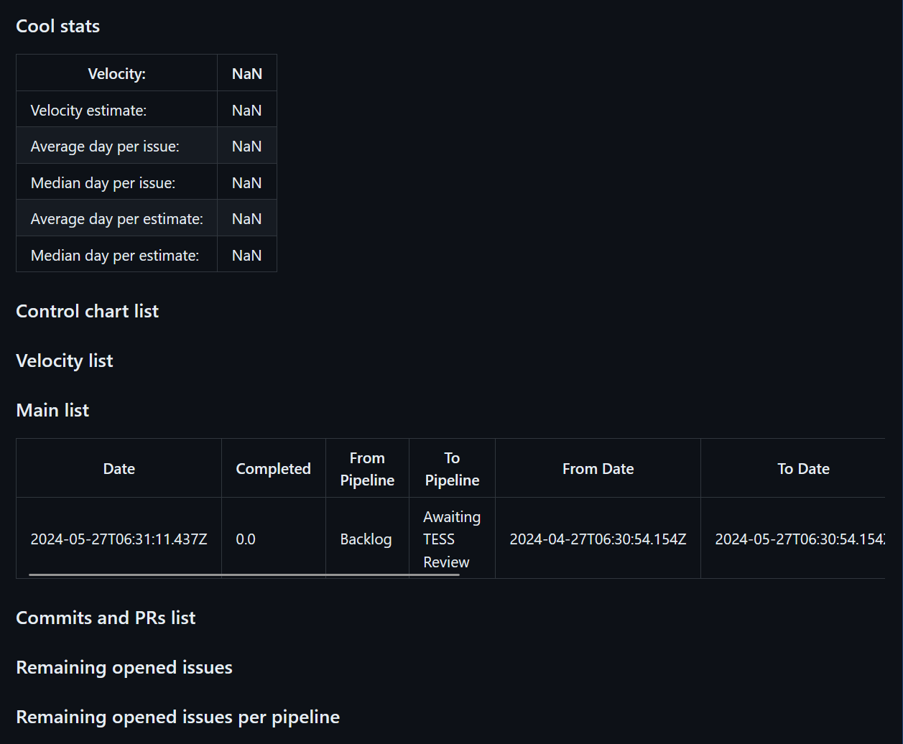

# Zenhub Issue Metrics Action

[](https://github.com/super-linter/super-linter)

[](https://github.com/lezhumain/zenhub_report_action/actions/workflows/check-dist.yml)
[](https://github.com/lezhumain/zenhub_report_action/actions/workflows/codeql-analysis.yml)
[](./badges/coverage.svg)

Based on:
[actions/typescript-action](https://github.com/actions/typescript-action)

Inspired by: [github/issue-metrics](https://github.com/github/issue-metrics)

This is a GitHub Action that searches for issues/pull requests in a zenhub
board, measures several metrics, and generates a report in form of a GitHub
issue.

This action, developed by lezhumain for my internal use, is open-sourced for
your potential benefit. Feel free to inquire about its usage by creating an
issue in this repository.

## Sample Report

The output of this action is a report in form of a GitHub issue. Below you see a
sample of such a GitHub issue.

TODO


## Getting Started

Create a workflow file (ie. `.github/workflows/zenhub-metrics.yml`) in your
repository with the following contents:

**Note**: `repo:owner/repo` is the repository you want to measure metrics on

```yaml
name: Monthly issue metrics
on:
  workflow_dispatch:
  schedule:
    - cron: '3 2 1 * *'

permissions:
  contents: read

jobs:
  build:
    name: issue metrics
    runs-on: ubuntu-latest
    permissions:
      issues: write
      pull-requests: read
    steps:
      - name: Run issue-metrics tool
        uses: lezhumain/zenhub_report_action@v1
        env:
          API_KEY: ${{ secrets.ZH_TOKEN }}
          GH_API_KEY: ${{ github.token }}
          WORKSPACE_ID: '5e3018c2d1715f5725d0b8c7'

      - name: Create issue
        uses: peter-evans/create-issue-from-file@v5
        with:
          title: Monthly zenhub metrics report
          content-filepath: ./zenhub_report.md
          assignees: ''
          labels: |
            report
          token: ${{ secrets.GH_TOKEN }}
```

## Example use cases

- TODO
- As a maintainer, I want to see metrics for issues and pull requests on the
  repository I maintain in order to ensure I am giving them the proper amount of
  attention.
- As a first responder on a repository, I want to ensure that users are getting
  contact from me in a reasonable amount of time.
- As an OSPO, I want to see how many open source repository requests are
  open/closed, and metrics for how long it takes to get through the open source
  process.
- As a product development team, I want to see metrics around how long pull
  request reviews are taking, so that we can reflect on that data during
  retrospectives.

## Support

If you need support using this project or have questions about it, please
[open up an issue in this repository](https://github.com/lezhumain/zenhub_report_action/issues).
Requests made directly to GitHub staff or support team will be redirected here
to open an issue. GitHub SLA's and support/services contracts do not apply to
this repository.

## Use as a GitHub Action TODO

1. Create a repository to host this GitHub Action or select an existing
   repository. This is easiest if it is the same repository as the one you want
   to measure metrics on.
2. Select a best fit workflow file from the
   [examples directory](./docs/example-workflows.md) for your use case.
3. Copy that example into your repository (from step 1) and into the proper
   directory for GitHub Actions: `.github/workflows/` directory with the file
   extension `.yml` (ie. `.github/workflows/issue-metrics.yml`)
4. Edit the values (`SEARCH_QUERY`, `assignees`) from the sample workflow with
   your information. See the [SEARCH_QUERY](./docs/search-query.md) section for
   more information on how to configure the search query.
5. If you are running metrics on a repository other than the one where the
   workflow file is going to be, then update the value of `GH_TOKEN`.
   - Do this by creating a
     [GitHub API token](https://docs.github.com/en/authentication/keeping-your-account-and-data-secure/managing-your-personal-access-tokens#creating-a-personal-access-token-classic)
     with permissions to read the repository and write issues.
   - Then take the value of the API token you just created, and
     [create a repository secret](https://docs.github.com/en/actions/security-guides/encrypted-secrets)
     where the name of the secret is `GH_TOKEN` and the value of the secret the
     API token.
   - Then finally update the workflow file to use that repository secret by
     changing `GH_TOKEN: ${{ secrets.GITHUB_TOKEN }}` to
     `GH_TOKEN: ${{ secrets.GH_TOKEN }}`. The name of the secret can really be
     anything. It just needs to match between when you create the secret name
     and when you refer to it in the workflow file.
6. If you want the resulting issue with the metrics in it to appear in a
   different repository other than the one the workflow file runs in, update the
   line `token: ${{ secrets.GITHUB_TOKEN }}` with your own GitHub API token
   stored as a repository secret.
   - This process is the same as described in the step above. More info on
     creating secrets can be found
     [here](https://docs.github.com/en/actions/security-guides/encrypted-secrets).
7. Commit the workflow file to the default branch (often `master` or `main`)
8. Wait for the action to trigger based on the `schedule` entry or manually
   trigger the workflow as shown in the
   [documentation](https://docs.github.com/en/actions/using-workflows/manually-running-a-workflow).

### Authentication

This action can be configured to authenticate with Personal Access Token (PAT):

#### Personal Access Token (PAT)

| field          | required | default | description                                   |
| -------------- | -------- | ------- | --------------------------------------------- |
| `GH_API_TOKEN` | True     | `""`    | The GitHub Token used to scan the repository. |
| `API_TOKEN`    | True     | `""`    | The Zenhub Token used to scan the repository. |

GH_API_TOKEN Must have read access to all repository you are interested in
scanning.

## Further Documentation

- [Example workflows](./docs/example-workflows.md)
- [Measuring time spent in labels](./docs/measure-time.md)
- [Assigning teams instead of individuals](./docs/assign-team-instead-of-individual.md)
- [Example using the JSON output instead of the Markdown output](./docs/example-using-json-instead-markdown-output.md)
- [Configuring the `SEARCH_QUERY`](./docs/search-query.md)
- [Local usage without Docker](./docs/local-usage-without-docker.md)
- [Authenticating with GitHub App Installation](./docs/authenticating-with-github-app-installation.md)
- [Dealing with large issue_metrics.md files](./docs/dealing-with-large-issue-metrics.md)

## Contributions

We would ❤️ contributions to improve this action. Please see
[CONTRIBUTING.md](./CONTRIBUTING.md) for how to get involved.

## License

[MIT](LICENSE)
